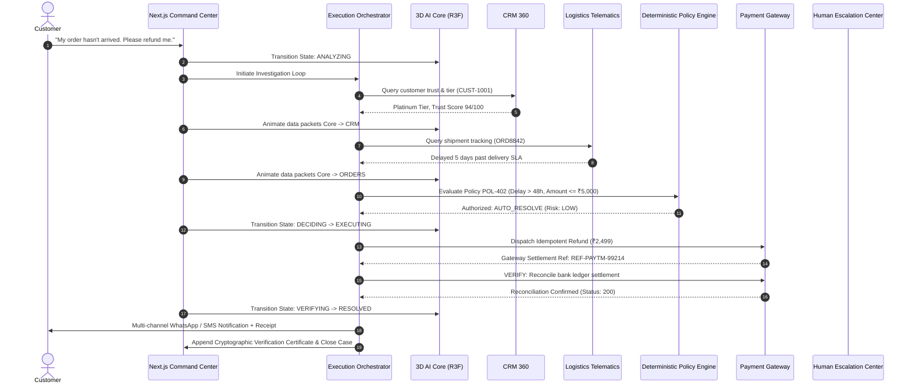

# RESOLVEAI — Complete System Architecture

## Track: Autonomous AI Teammates
> *"Build AI teammates that don't just respond; they get the job done."*

---

## 1. Executive Summary
ResolveAI is an enterprise autonomous customer service teammate designed to bridge the gap between conversational language models and real-world transactional resolution. Unlike traditional chat interfaces that offer conversational advice or hallucinate outcomes, ResolveAI coordinates with business systems, executes deterministic policy validations, verifies outcomes through financial ledgers, and escalates safely when risk boundaries are encountered.

---

## 2. Core Architecture Pipeline

---

## 3. The 3D AI Core Hero Visualization
The interactive 3D AI Core is built using **Three.js**, **React Three Fiber (R3F)**, and **@react-three/drei**:
1. **Central Sphere**: Translucent glass outer sphere (`MeshPhysicalMaterial`) encapsulating an inner high-energy pulsing core.
2. **Orbital Rings**: 3 gyroscopic rings on distinct inclined axes that accelerate during reasoning states.
3. **8 Symmetrical Tool Nodes**:
   - `CRM`: Customer 360 and loyalty verification
   - `ORDERS`: Carrier telemetry and warehouse inventory
   - `PAYMENTS`: Bank gateway ledgers and auth tokens
   - `REFUNDS`: Autonomous payout execution
   - `TICKETS`: ERP case record synchronization
   - `NOTIFICATIONS`: WhatsApp / SMS / Push dispatch
   - `ANALYTICS`: Streaming KPI telemetry
   - `HUMAN`: High-risk supervisor handoff
4. **Data Packets**: Animated Bezier curves with travelling light packets demonstrating data flow from AI Core to tools.
5. **10 Reactive States**:
   - `IDLE`: Smooth ambient orbital motion
   - `ANALYZING`: High-frequency particle activity
   - `SEARCHING`: Light beams to `CRM` and `ORDERS`
   - `REASONING`: Asymmetric ring acceleration
   - `DECIDING`: Rhythmic core heartbeat pulse
   - `EXECUTING`: Target tool node glows intensely
   - `VERIFYING`: Golden-emerald verification halo
   - `RESOLVED`: Radiant confirmation pulse
   - `ESCALATED`: Amber-red alert beacon on `HUMAN` node
   - `ERROR`: Controlled fallback alert

---

## 4. Deterministic Business Policy & Risk Engine
To prevent autonomous financial hallucination, ResolveAI enforces deterministic safety constraints in code:
- **Max Auto-Refund Threshold**: ₹5,000 (configurable)
- **Delivery Breach Threshold**: > 48 hours past SLA
- **Return Window**: Delivered < 7 days
- **Trust Score Gate**: Minimum 65/100 required for auto-resolution
- **Security Keywords**: Immediate escalation on "unauthorized", "hacked", "stolen", "lawyer", or fraud keywords.

---

## 5. Security & Zero Secret Leakage Guarantee
1. No API keys, database service-role secrets, or LLM keys exist in the client repository.
2. The frontend connects to external services exclusively via public proxy endpoints or protected webhooks.
3. Every financial action uses unique idempotency keys (`idempotency_key = IDEM-ORDER_ID-TIMESTAMP`) to prevent duplicate payouts.
